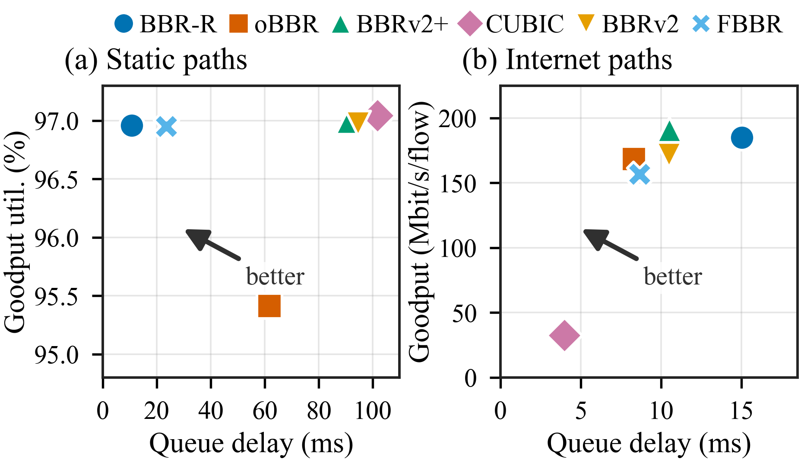

jer：美国新泽西
lon：英国伦敦
tok/tokyo：日本东京

#### 测试二 3流 lon发 tokyo收

| 算法 | 好吞吐 (Mb) | 排队 mean (ms) | 排队 p95 (ms) | 排队 p99 (ms) | 丢包率 (%) |
|------|------------|---------------|--------------|--------------|-----------|
| bbr_r | 680.882400 | 9.923 | 24.502 | 35.799 | 0.0000 |
| bbrv2plus | 659.260800 | 3.920 | 11.845 | 17.509 | 0.0000 |
| obbr | 594.729600 | 3.509 | 10.494 | 15.984 | 0.0000 |
| bbrv2 | 594.392800 | 4.745 | 12.721 | 17.673 | 0.0000 |
| fbbr | 519.015200 | 3.342 | 11.237 | 17.275 | 0.0000 |
| cubic | 66.638880 | 2.791 | 6.932 | 9.779 | 0.0000 |

#### 测试三 3流 jersey 发 tokyo 收

| 算法 | 好吞吐 (Mb) | 排队 mean (ms) | 排队 p95 (ms) | 排队 p99 (ms) | 丢包率 (%) |
|------|------------|---------------|--------------|--------------|-----------|
| bbr_r | 781.070400 | 7.770 | 24.166 | 38.753 | 0.0000 |
| bbrv2plus | 747.766400 | 8.014 | 20.732 | 30.716 | 0.0000 |
| obbr | 688.583200 | 6.520 | 16.267 | 23.736 | 0.0000 |
| bbrv2 | 630.936000 | 5.766 | 15.432 | 27.198 | 0.0000 |
| fbbr | 604.624000 | 4.705 | 14.084 | 24.191 | 0.0000 |
| cubic | 115.087600 | 4.308 | 9.695 | 10.283 | 0.0000 |

#### 测试五 3流 lon发jer

| 算法 | 好吞吐 (Mb) | 排队 mean (ms) | 排队 p95 (ms) | 排队 p99 (ms) | 丢包率 (%) |
|------|------------|---------------|--------------|--------------|-----------|
| bbrv2plus | 717.751200 | 5.952 | 14.379 | 20.256 | 0.0000 |
| bbr_r | 698.630400 | 10.927 | 23.082 | 29.925 | 0.0000 |
| bbrv2 | 620.619200 | 4.126 | 11.224 | 16.354 | 0.0000 |
| obbr | 554.050400 | 5.541 | 13.700 | 19.770 | 0.0000 |
| fbbr | 542.605600 | 3.803 | 11.851 | 19.256 | 0.0000 |
| cubic | 163.487520 | 2.105 | 7.625 | 11.330 | 0.0000 |

### Round 9 3流 tok发jer

| 算法 (Algorithm) | 好吞吐 (Mb) | 排队 mean (ms) | 排队 p95 (ms) | 排队 p99 (ms) | 丢包率 (%) |
| :--- | :--- | :--- | :--- | :--- | :--- |
| bbrv2plus | 734.544800 | 6.469 | 20.891 | 33.469 | 0.0000 |
| bbr_r | 684.129600 | 9.442 | 29.291 | 48.994 | 0.0000 |
| bbrv2 | 682.288000 | 6.920 | 18.807 | 39.386 | 0.0000 |
| obbr | 665.142400 | 6.656 | 17.393 | 24.698 | 0.0000 |
| fbbr | 633.596000 | 7.176 | 18.575 | 27.794 | 0.0000 |
| cubic | 40.668688 | 1.430 | 1.702 | 2.165 | 0.0000 |

### 10流 tok发lon

| 测试轮次 | 算法 | 好吞吐 (Mb) | 排队 mean (ms) | 排队 p95 (ms) | 排队 p99 (ms) | 丢包率 (%) |
| :--- | :--- | :--- | :--- | :--- | :--- | :--- |
| **Round 11** | obbr | 766.651360 | 15.587 | 32.825 | 40.558 | 0.0000 |
| | bbrv2 | 752.348880 | 22.703 | 57.414 | 89.064 | 0.0000 |
| | bbrv2plus | 724.805520 | 23.044 | 65.455 | 126.082 | 0.0000 |
| | bbr_r | 694.217120 | 26.083 | 56.021 | 76.446 | 0.0000 |
| | fbbr | 653.061200 | 18.252 | 48.825 | 81.132 | 0.0000 |
| | cubic | 133.343848 | 7.578 | 17.183 | 24.103 | 0.0000 |

### 10流 jer 发lon
| **Round 12** | bbrv2 | 1129.917600 | 15.787 | 33.604 | 48.005 | 0.0000 |
| | bbrv2plus | 1118.006400 | 17.263 | 38.880 | 56.375 | 0.0000 |
| | bbr_r | 1072.556800 | 23.708 | 47.708 | 60.988 | 0.0000 |
| | obbr | 922.549600 | 12.358 | 24.669 | 32.278 | 0.0000 |
| | fbbr | 914.891200 | 14.416 | 31.496 | 46.158 | 0.0000 |
| | cubic | 278.568400 | 3.714 | 8.740 | 13.633 | 0.0000 |

### 3流 tok发lon
| **Round 13** | bbrv2plus | 711.387200 | 6.041 | 20.540 | 32.561 | 0.0000 |
| | obbr | 639.108800 | 6.978 | 18.435 | 25.691 | 0.0000 |
| | bbr_r | 619.078400 | 11.578 | 31.617 | 61.128 | 0.0000 |
| | bbrv2 | 580.036800 | 11.552 | 30.733 | 99.558 | 0.0000 |
| | fbbr | 571.940000 | 5.866 | 18.781 | 28.076 | 0.0000 |
| | cubic | 53.902400 | 4.927 | 9.629 | 11.564 | 0.0000 |

### 10流 jer 发tok
| **Round 16** | bbrv2plus | 1072.964000 | 16.334 | 34.183 | 42.743 | 0.0000 |
| | bbr_r | 988.747200 | 26.107 | 50.363 | 63.412 | 0.0000 |
| | bbrv2 | 952.400000 | 14.478 | 30.088 | 38.222 | 0.0000 |
| | obbr | 858.139680 | 12.692 | 26.096 | 31.182 | 0.0000 |
| | fbbr | 834.776320 | 14.139 | 30.491 | 41.342 | 0.0000 |
| | cubic | 107.440424 | 4.623 | 13.146 | 18.235 | 0.0000 |

### 补做昨天 3流 tok 发jer
| **Round 20** | bbrv2plus | 714.831200 | 7.676 | 24.438 | 54.029 | 0.0000 |
| | bbr_r | 702.544800 | 9.885 | 30.012 | 61.054 | 0.0000 |
| | bbrv2 | 673.434400 | 8.358 | 22.852 | 40.418 | 0.0000 |
| | fbbr | 637.978400 | 6.290 | 18.918 | 30.604 | 0.0000 |
| | obbr | 636.334400 | 4.884 | 15.697 | 22.571 | 0.0000 |
| | cubic | 279.182400 | 4.404 | 11.139 | 14.416 | 0.0000 |

### 综合吞吐-时延散点图

该图从排队时延和有效吞吐两个维度汇总比较各拥塞控制算法的性能。每个标记代表一个算法在相应数据集全部场景上的最终平均结果，而不是某一条流、某一个场景或某一轮实验的单独结果。横轴为排队延迟（`Queue delay (ms)`），数值越小越好；左图纵轴为有效吞吐利用率（`Goodput util. (%)`），右图纵轴为平均每流有效吞吐（`Goodput (Mbit/s/flow)`），数值越大越好。因此，在同一子图中，越靠近左上角通常表示时延更低、吞吐更高，图中的 `better` 箭头表示这一综合优化方向。

图中只保留两个数据集都出现的六种算法：`BBR-R`、`oBBR`、`BBRv2+`、`CUBIC`、`BBRv2` 和 `FBBR`；`BBRv2-formal` 未纳入比较。两个子图的纵轴统计量和单位不同，不能直接比较纵坐标的绝对数值；散点图应分别在各自子图内部比较算法之间的相对位置。

- **(a) Static paths：** 数据来自 [Test2 最终结果](NS3.27/results/test2/RESULTS.md) 的 `## 总体指标`。横坐标使用六个静态路径场景汇总得到的平均排队延迟，纵坐标使用对应的平均有效吞吐利用率；六个场景采用非加权平均，即每个场景对最终点值贡献相同。这里的纵坐标是百分比利用率，不是互联网测试中的 Mbit/s/flow，因此不能与子图 (b) 的纵坐标直接对照。
- **(b) Internet paths：** 数据来自本文前面的互联网路径测试表，包含 9 个场景，其中有 3 流和 10 流场景。对每个算法，先在每个场景内计算 `总好吞吐 ÷ 该场景流数`，得到该场景的平均每流好吞吐；随后对该算法的 9 个场景结果做等权算术平均，作为纵坐标。横坐标则对每个场景的 `mean` 排队延迟做等权算术平均。也就是说，图中没有直接对 3 流和 10 流的总吞吐做平均：先按流数归一化，再按场景平均，从而避免 10 流场景仅因总流数更多就对总吞吐均值产生不合理的支配作用。

按当前脚本实际读取和计算的结果，两个子图的最终绘图坐标如下（延迟单位为 ms）：

| 算法 | (a) Queue delay | (a) Goodput util. (%) | (b) Queue delay | (b) Goodput (Mbit/s/flow) |
| --- | ---: | ---: | ---: | ---: |
| BBR-R | 10.6969 | 96.9605 | 15.0470 | 184.9256 |
| oBBR | 61.8063 | 95.4103 | 8.3028 | 168.2278 |
| BBRv2+ | 90.9670 | 96.9910 | 10.5237 | 191.1213 |
| CUBIC | 101.7072 | 97.0455 | 3.9867 | 32.3990 |
| BBRv2 | 94.5844 | 96.9765 | 10.4928 | 171.5595 |
| FBBR | 23.5902 | 96.9501 | 8.6654 | 156.6881 |

这些点值是场景均值，图中未绘制误差棒；因此该图主要用于展示不同算法的平均吞吐—时延折中关系，不能替代各场景的分布、波动范围或显著性检验。具体场景结果仍应结合上面的分流数、吞吐和 `mean`/`p95`/`p99` 时延表格一起分析。

[下载 PDF 矢量版](result/internet/algorithm_throughput_latency.pdf)
